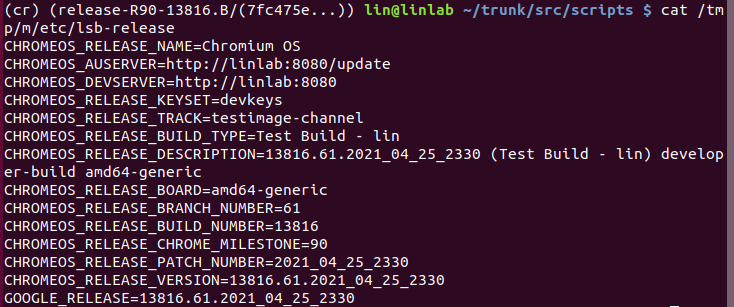

## How to Build Chromium OS

---

#### Prerequisites

1. [Ubuntu 18.04.5 LTS (Bionic Beaver)](https://releases.ubuntu.com/18.04/) and above

2. x86-64 bit system (You can use ```uname -m``` to verify) 

3. A build server at US is highly recommended. Or at least you need a reliable VPN. You have **a lot of things ** to download.
   1. It might take over 10 hrs to download and build the source codes if you are using a Quad-Core CPU with 8GB of RAM and 100Mbps brand width. The codes might use up to 200GB disk space. (You don't want to redo everything after you find that you don't have enough disk space).
   
   2. The folder size after downloading and building everything is 108GB
   
      
   
4. Use Ethernet if available.

**This guide is build on [release-R90-13816.B](https://chromium.googlesource.com/chromiumos/manifest.git/+/refs/heads/release-R90-13816.B)**

```shell
# In this guide
$ cmd # this cmd is running outside the cros chroot env
(chroot) cmd # this cmd is running inside the cros chroot env
```


#### Dependencies

1. Install git, curl, lvm tools, and python.

```shell
$ sudo apt-get install git-core gitk git-gui curl lvm2 thin-provisioning-tools \
     python-pkg-resources python-virtualenv python-oauth2client xz-utils \
     python3.6
```

#### Get Source Codes

1. Install the depot tools. This step is necessary because we will use **repo** cmd to sync source codes. 

   Use the following cmd to clone the depot_tools repository

   ```shell
   $ git clone https://chromium.googlesource.com/chromium/tools/depot_tools.git
   ```

   Append ```export PATH={path to depot_tools}:$PATH ``` to ```~/.bashrc``` or ```~/.zshrc```

   Two ways to enable the depot tools
   
   1. Restart the terminal
   2. Or ```source .bashrc / source .zshrc```

#### Set up Environments

2. Add the gerrit credentials, you might have trouble accessing the codes if you don't have gerrit credentials.

   [Gerrit Guide](https://www.chromium.org/developers/gerrit-guide)

2. Create the folder and get the source codes (You can use -b to specify the branch you want)

   ```shell
   $ mkdir -p ~/chromiumos
   $ cd ~/chromiumos
   $ repo init -u https://chromium.googlesource.com/chromiumos/manifest.git --repo-url https://chromium.googlesource.com/external/repo.git [-b branch] # for example -b release-R90-13816.B
   $ repo sync [-j{int}] # -j{int} tells repo cmd how many repositories to sync at the same time. Default is 8
   ```

   Note that the syncing process could take a **long** time. In my case, about 20G data downloaded. The size of chromiumos folder after syncing is 36G.

3. Set up Google Storage Buckets

   Building and testing Chromium OS requires access to Google Storage. This is done via [gsutil](https://chromium.googlesource.com/chromiumos/docs/+/master/gsutil.md).

4. Making sudo more permissive, this step is required for using ```cros_sdk```.

   ```shell
   $ sudo EDITOR=/bin/nano visudo -f /etc/sudoers.d/relax_requirements # Use editor nano to modify sudoers.d configuration file.
   ```

   Add following configurations in the editor, and use ```ctrl + O, ctrl + X``` to save the change

   ```shell
   Defaults !tty_tickets # all open local and remote logon sessions would have sudo without a password within the password timeout window
   Defaults timestamp_timeout=180 # Set timeout to 180 mins
   ```

5. Create a chroot

   All building is done inside the chroot environment. We use chroot to make sure everyone uses the same environment and tools to build Chromium OS.

   ```shell
   $ cros_sdk # Assume you already in the dir ~/chromiumos
   ```

   This cmd will create  a new chroot environment if there doesn't exist any. Or enter the chroot environment

   You will see the following prompt

   ```shell
   (cr) (branch/(...)) username@pcname ~/trunk/src/scripts $
   ```

   You can set the password for the shared user account ```chronos``` on the Chromium OS

   ```shell
   (chroot) ./set_shared_user_password.sh
   ```

#### Build the Codes

1. Build the packages for your broad (In this case, board=amd64-generic)

   ```shell
   (chroot) ./build_packages --board=${BOARD}
   ```

2. Build the disk image

   There are 3 options, test, dev, or base

   ```shell
   (chroot) ./build_image --board=${BOARD} --noenable_rootfs_verification [option]
   ```

3. Build an image to run in a virtual machine

   Don't forget to add corresponding flag when you export the image. If you passed the test flag in previous step, you **have** to use the same flag. Or the build script can't find the source file.

   ```
   (chroot) ./image_to_vm.sh --board=${BOARD} [option]
   ```

#### Download the Image (Optional)

If you are building the codes on a remote server, you can use [scp](https://linux.die.net/man/1/scp) cmd to download the image

#### Run the Chromium OS in VM

Enter the cros sdk

```shell
(chroot) cros_vm --start --board amd64-generic
```

~~In the official Chrome OS VM document, it said you had to download the Simple Chrome SDK in order to run the VM. But in fact, the Chromium OS SDK has the cros_vm inside the cros_sdk enviroment~~

Then you can either use ssh or VNC to test the VM

```shell
$ ssh root@localhost -p 9222 # Default pw is test0000
$ crosh # use crosh to enter the Chrome OS developer shell
```


#### Kernel Replacement

Chromium OS is using kernel 4.14 by default. How to upgrade it to kernel 5.10 LTS? (The newer, the better?)

You might want to read some [**Portage**](https://wiki.gentoo.org/wiki/Gentoo_Cheat_Sheet) tutorials. Portage is a package management system created for and used by Google

The kernel version to build is controlled by a make file under ```src/overlays/overlays-{BOARD}/profiles/base/make.defaults```

Change the kernel version ```kernel-4_14``` to ```kernel-5_10```

Rebuild the packages and image

```cros_workon start``` tells the build use customize package instead of official one.

```shell
(chroot) emerge-amd64-generic --unmerge chromeos-kernel-4_14
(chroot) cros_workon --board=amd64-generic start sys-kernel/chromeos-kernel-5_10
(chroot) cros_workon --board=amd64-generic --install chromeos-kernel-5_10
(chroot) emerage-amd64-generic sys-kernel/chromeos-kernel-5_10
(chroot) ./build_packages --board=${BOARD}
(chroot) ./build_image --board=${BOARD} --noenable_rootfs_verification [option]
(chroot) ./image_to_vm.sh --board=${BOARD} [option]
```

#### CrOS Dev Server

```cros_sdk``` ships with a dev server that allows you to update your Chromium OS without flashing them via a USB drive.

```shell
(chroot) start_devserver [--port port_num]
```

The default listen port is 8080, but I would recommend you change it to other port because there are many other programs use this port by default.

Type ```http://url:port``` in your browser.


Note: If you encounter any bugs or errors when you run the vm and dev server. You can use ```lsof -i :9222 # for VM``` or ```lsof -i :[Dev server port] # 8080 by default``` to find the process PID and use ```kill -9 PID``` to kill the process

#### Deploy CrOS Dev Server in Docker

There are two ways (as far as I know) to deploy the dev server in docker

1. Set up a Ubuntu docker server, install the cros_sdk environment inside the docker. It's better to setup a volume for the docker so you don't need to download the cros_sdk every time you start the docker.
2. [Experimental] I found that ```start_devserver``` invokes python scripts in ```/etc/lib/devserver```, I tried to extract the python files from that folder. But I failed to start the dev server. I am not sure if it depends on other SDK tools. It seems like the dev server is a webserver listening to update requests and returns the update payload in the static folder. Might need to dig into the dev server and update_engine source codes.

#### Communication between Chromium OS and Dev Server

There are two ways to update the Chromium OS update server address.

1. In order to edit the release configuration, you have to mount the image to your local machine.

   ```shell
   (chroot) ./mount_gpt_image.sh -i chromiumos_test_image.bin --board=amd64-generic --most_recent
   ```

   This cmd will mount the most recent build image under ```/tmp/m```

   Change the ```CHROMEOS_DEVSERVER``` variable to ```http://url:port```.

   Then start the Dev server from another terminal

   ```shell
   (chroot) sudo start_devserver -port [port_num]
   (chroot) cros_vm --start --board amd64-generic --copy-on-write
   ```

2. In the VM, create a file named ```lsb-release``` and place it in ```/mnt/stateful_partition/etc```. It will override the ```/etc/lsb-release``` (You can't directly modify the ```/etc/lsb-release```, it is a configuration file and read-only).

   ```shell
   $ cp /etc/lsb-release /mnt/stateful_partition/etc/lsb-release
   $ sudo nano /mnt/stateful_partition/etc/lsb-release
   ```

   

**Test update**

Unfortunately, the dev server document is not up to date. I didn't find any tutorials about how to generate an update payload.


But I figured out how to let Chromium OS communicate with the Dev Server

```shell
update_engine_client --update # Use this cmd in Chromium OS terminal
```

If you have server and Chromium OS set up correctly. You will see the following messages.


**^ Client is waiting for update**


**^ Dev server receives the update check packet**


## Reference

[Chromium OS Developer Guide](https://chromium.googlesource.com/chromiumos/docs/+/master/developer_guide.md)

[Kernel Configuration](https://www.chromium.org/chromium-os/how-tos-and-troubleshooting/kernel-configuration)

[Portage](https://wiki.gentoo.org/wiki/Gentoo_Cheat_Sheet)

[Dev Server](https://chromium.googlesource.com/chromiumos/chromite/+/refs/heads/master/docs/devserver.md)

